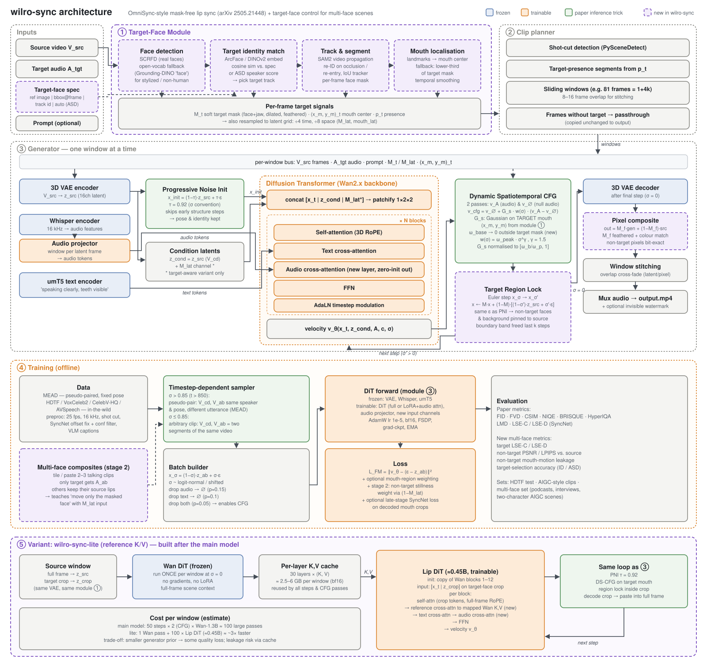

# wilro-sync — Implementation Plan

Open-source re-implementation of **OmniSync: Towards Universal Lip Synchronization via Diffusion Transformers** (Peng et al., NeurIPS 2025, [arXiv:2505.21448](https://arxiv.org/abs/2505.21448)), plus one extension: **in multi-face scenes, only the user-chosen target face is lip-synced**.

The authors have only a [project page](https://ziqiaopeng.github.io/OmniSync/). As far as I can find, they have not released code or weights, so this is an independent re-implementation and its numbers will not match the paper exactly.



## Progress (main track)

| Milestone | Status |
|---|---|
| M0 scaffold | **done**: packaging, CLI, configs, CI, Wan2.1 backbone wrapper (bit-exact with diffusers on the real 1.3B weights) |
| M2 inference pipeline | **done (needs a trained checkpoint)**: noise init, target-aware DS-CFG, region lock, composite, planner, stitching. Target from a bbox or the whole frame; detector-based selection is M1. |
| M3 data pipeline | **mostly done**: data stages smoke / first_model / paper_scale (`wilro-sync data`): HDTF + TalkVid acquisition, automatic face crops, MEAD pairs, held-out identities, SyncNet filtering + A/V offset correction, incremental clip preparation; LSE-C/D metrics. Still to do: per-frame mouth landmarks. |
| M4 model + training | **code done**: audio projector + cross-attn, widened input, LoRA/adapter/full modes, timestep-dependent sampler, CFG dropout, EMA, checkpoints. Next: first GPU run. |
| M1, M5–M8 | not started |


---

## 1. What the paper specifies vs. what we must decide

| Specified by the paper | Value |
|---|---|
| Objective | Conditional flow matching, `(V_cd, A_ab) → V_ab` |
| Backbone | DiT with self-attn, temporal attn, text cross-attn, **audio cross-attn**, FFN; 3D VAE; condition video latents channel-concatenated with noise |
| Encoders | Whisper (audio), T5 (text), 3D VAE — all frozen |
| Timestep-dependent sampling | `t > 850` → pseudo-paired data (MEAD); `t ≤ 850` → arbitrary videos |
| Progressive noise init | `x_init = (1−τ)·V_src + τ·ε`, **τ = 0.92**, then denoise (50-step schedule) |
| DS-CFG | Spatial Gaussian on mouth `(x_m, y_m)`, temporal `ω(t) = ω_peak·(t/T)^γ`, **γ = 1.5** |
| Training | AdamW, lr 1e-5, batch 64, 80k steps, 64×A100 ≈ 80 h, MEAD + ~400 h YouTube |
| Text prompts | e.g. "A person speaking loudly with clear facial and tooth movements" (stronger articulation) |

| We decide | Proposal |
|---|---|
| Base DiT | **Wan2.1-T2V-1.3B** for development (fits a single 24–48 GB GPU at 480p). **Wan2.2-TI2V-5B** for the release model. Both are Apache-2.0, flow-matching, umT5 + 3D VAE, which matches the paper's Fig. 2. Hidden behind a `Backbone` interface so it can be swapped. |
| Trainable params | Stage A: audio projector + audio cross-attn + new input-channel weights (zero-init), plus LoRA on the DiT. Stage B: full DiT fine-tune if compute allows. |
| ω_base, ω_peak, σ (Gaussian) | Grid search on the validation set. Start with ω_base = 1.0, ω_peak = 4.5, σ ≈ 0.15 × face width. |
| Audio alignment | Whisper features at 50 Hz, windowed (±2 latent frames) per latent frame, which deals with the VAE's 4× temporal compression |
| Clip length / res | 81 frames @ 25 fps (1 + 4k latent constraint), 480p dev → 720p release |
| CFG dropout | audio 15 %, text 10 %, both 5 % |

**Inconsistencies in the paper we resolve explicitly:**

1. Eq. 2 uses `x_t = (1−t)x_0 + t·V_ab` (t = 1 is data), while Eq. 5 uses τ as a *noise* level. We use one convention everywhere: Wan's `x_σ = (1−σ)·x_data + σ·ε` (σ = 1 is noise). τ = 0.92 is σ_start, and `t > 850` is σ > 0.85.
2. Eq. 9 multiplies `G_spatial · ω(t)`, and both already contain ω_peak, so the peak gets counted twice. We normalise `G_s` to `[ω_base/ω_peak, 1]` so that the peak strength equals ω_peak.
3. Eq. 8 written in σ is `w(σ) = ω_peak · σ^γ`, which is strong early (high noise) and weak late, as the text describes.

---

## 2. Target-face extension (the new requirement)

**Why it's needed.** A mask-free model trained on single-speaker clips learns "audio → move the mouth". If a frame contains several faces, nothing stops it from moving *every* mouth. The paper's framework has no notion of *which* face to edit.

### 2.1 Target specification (`--target`)

| Mode | Example | How it resolves |
|---|---|---|
| Reference image(s) | `--target ref.jpg` | ArcFace embedding, cosine match against tracks. For stylized or non-human faces, DINOv2 embedding instead. |
| Box on a frame | `--target "frame=120:bbox=410,80,620,330"` | Seed for SAM2 video propagation. No detector is needed, so this works for any character. |
| Track ID | `wilro-sync faces in.mp4` → `--target track=2` | The CLI first dumps thumbnails of every track with its ID |
| Auto | `--target auto` | Active-speaker detection (LR-ASD / TalkNet): picks the track whose visual activity best matches the audio |
| Gradio demo | click on a face | Same as "box on a frame" |

### 2.2 Target-Face Module (module ① in the diagram)

1. **Detect.** SCRFD (InsightFace) for real faces. When it finds nothing, or the user asks for it, fall back to Grounding-DINO with the prompt "face". This keeps the paper's support for stylized and non-human characters.
2. **Match identity.** Cosine similarity against the spec, with Hungarian assignment per frame and a threshold plus hysteresis.
3. **Track & segment.** SAM2 video predictor seeded from the matched box. Re-ID when the target is lost to occlusion or leaves the frame and comes back.
4. **Mouth localisation.** 2D landmarks (mouth center). If landmarks fail, use the lower third of the SAM2 mask. Smoothed over time with a One-Euro filter.
5. **Outputs per frame:** soft mask `M_t` (face + jaw, dilated about 10 %, feathered), `(x_m, y_m)_t`, and presence `p_t`. Also resampled to the latent grid (÷4 time, ÷8 space) as `M_lat` and `mouth_lat`.

### 2.3 Four layers that keep edits on the target

| Layer | Where | Training needed? | Effect |
|---|---|---|---|
| **L1 – Target-focused DS-CFG** | guidance | no | Gaussian centered on the *target's* mouth. ω_base → 0 outside `M_lat`, so audio guidance only pushes the target. |
| **L2 – Target Region Lock** | every denoising step | no | `x ← M·x + (1−M)·[(1−σ')·z_src + σ'·ε]` uses the **same ε as the noise init**. Non-target faces and the background stay on the source's trajectory. The mask boundary band is released for the last k steps so the seams blend. |
| **L3 – Pixel composite** | after decode | no | `out = M_f·gen + (1−M_f)·src` with a feathered mask and colour matching, so non-target pixels are **bit-exact** to the source. |
| **L4 – Target-aware model** (stage 2) | training | yes | Adds `M_lat` as an extra input channel and trains on synthetic multi-face composites where only one face gets the new audio. This helps when faces are close or overlapping, where L2 alone leaves artifacts. |

L1–L3 need no extra training, so they work with any checkpoint. L4 is an optional quality upgrade.

### 2.4 Edge cases

- Target absent in a frame range → that range passes through untouched (clip planner).
- Target partially occluded → the SAM2 mask shrinks, and the lock keeps the occluder intact.
- Faces overlapping → the target's mask wins, and a warning is logged.
- Multiple targets with different audio → v1 runs sequential passes. Later: `--target A=a.wav --target B=b.wav` in one pass with a per-region audio map.
- Shot cuts → the planner splits windows at cuts, and identity is re-matched in each shot.

---

## 3. Variant: wilro-sync-lite (reference K/V design)

This is a second, faster model, built **after** the main model works. Instead of adapting Wan in place, Wan stays fully frozen and acts as a **reference encoder**. A smaller **Lip DiT** does the denoising. It reuses the same data pipeline, target-face module and inference tricks as the main model.

```
Source window ─▶ Wan DiT (frozen, run once, σ = 0) ─▶ per-layer K,V cache (30 layers)
                                                             │ layer-mapped cross-attn
x_t (target-face crop) ─▶ Lip DiT (~0.45B, trainable) ◀──────┘
                              ▲ audio tokens, text tokens
                              └─▶ velocity → same PNI / DS-CFG / region lock / composite
```

| Design point | Choice |
|---|---|
| Reference pass | Wan-1.3B on the **full-frame** clean source latent (σ = 0), once per window, no gradients. Cache the K,V of every block's self-attention. |
| Lip DiT | A copy of **Wan blocks 1–12** (≈0.45B), so it starts with a visual prior instead of from scratch. Each block gets a new **reference cross-attention** (output zero-initialised) to the cached K,V of its mapped Wan layers (≈2.5 Wan layers per Lip-DiT block). It also gets the same audio cross-attention + projector as the main model. |
| Tokens | The Lip DiT sees only the **target-face crop** (crop mode), while the Wan cache covers the whole frame. Crop tokens get RoPE positions offset to their full-frame coordinates, so both sides share one position space. |
| Input | `[x_t \| z_crop]` channel concat, as in the main model, so the noise initialisation works unchanged. |
| Training | Same data and timestep-dependent sampler. The Wan reference pass runs on the fly under `no_grad`. The cache is too large to pre-compute: ≈2.5–6 GB per clip. Trainable: Lip DiT (full), reference cross-attention, audio layers (≈0.67B total). |
| Inference | Same τ, DS-CFG, region lock (inside the crop), paste-back. Both guidance passes share one reference cache, and the unconditional pass drops audio only. |

**Expected trade-offs (to be measured):**

- **Speed:** ≈3× faster per window. That's 1 Wan pass + 100 Lip-DiT passes, vs. 100 Wan passes for the main model (50 steps × 2 for guidance).
- **Training memory:** ≈18–20 GB with AdamW, ≈12–14 GB with 8-bit Adam. That's much lower than fully fine-tuning Wan, and similar to the main model with LoRA.
- **Quality:** teeth, tongue and stylized faces depend on the smaller Lip DiT's prior. Expect some loss vs. the main model.
- **Lip leakage:** the cache contains the source mouth, and cross-attention makes copying it easy. Mitigations: the timestep-dependent sampler, DS-CFG, and an optional *reference mouth dropout* (drop cached tokens in the target-mouth area with p≈0.5 during training).

**Status:** an extra variant. It is not part of reproducing the paper, which uses the main model.

---

## 4. Repository layout

```
wilro-sync/
├── README.md  LICENSE  pyproject.toml  CITATION.cff
├── configs/                  # hydra/omegaconf: model, train, infer, data
├── wilrosync/
│   ├── models/
│   │   ├── backbone/         # Backbone interface + wan21.py, wan22.py
│   │   ├── audio.py          # Whisper wrapper + AudioProjector
│   │   ├── dit_lipsync.py    # input-channel expansion, audio cross-attn injection
│   │   ├── lora.py
│   │   └── lite/             # ref_cache.py (frozen Wan K/V), lip_dit.py, layer_map.py
│   ├── pipeline/
│   │   ├── sampler.py        # flow-matching Euler/UniPC, PNI
│   │   ├── dscfg.py          # spatial/temporal guidance maps
│   │   ├── region_lock.py    # L2
│   │   ├── composite.py      # L3, colour match
│   │   ├── planner.py        # shot cuts, windows, passthrough
│   │   └── lipsync.py        # end-to-end LipSyncPipeline
│   ├── face/
│   │   ├── detect.py  identity.py  track.py  mouth.py  asd.py
│   │   └── target.py         # TargetSpec parsing → TargetSignals
│   ├── data/
│   │   ├── preprocess/       # fps/sr, scene cut, SyncNet offset+conf, captions
│   │   ├── datasets.py       # MEAD pairs, arbitrary clips, multi-face composites
│   │   └── sampler.py        # timestep-dependent sampling
│   ├── train/                # accelerate/FSDP trainer, EMA, ckpt
│   └── eval/                 # metrics + multi-face metrics
├── scripts/                  # download_weights.sh, prepare_*.py
├── apps/gradio_app.py        # click-to-select target face
├── tests/                    # unit tests (math, masks, planner) + tiny e2e
└── docs/  PLAN.md  assets/architecture.svg
```

Public API:

```python
pipe = LipSyncPipeline.from_pretrained("wilro/wilro-sync-5b")
pipe(video="in.mp4", audio="speech.wav", target="ref.jpg",
     tau=0.92, steps=50, omega_peak=4.5, gamma=1.5).save("out.mp4")
```

---

## 5. Milestones

| # | Milestone | Deliverables | Done when |
|---|---|---|---|
| **M0** | Scaffold (≈1 wk) | repo, packaging, CI (ruff, pytest, CPU-only tests), configs, `Backbone` interface, Wan2.1 loads and generates T2V | CI green; T2V sample reproduces upstream |
| **M1** | Target-Face Module (≈2 wk, **starts in parallel**) | detect/identity/track/mouth/ASD, `wilro-sync faces` CLI, mask visualiser | ≥ 95 % target-selection accuracy on our 30-clip multi-face set |
| **M2** | Inference pipeline with a stand-in generator (≈1–2 wk) | PNI, DS-CFG, region lock, composite, planner, stitching; a `Generator` adapter for **LatentSync** so M1 + L2/L3 can be demoed before our model exists | Non-target PSNR = ∞ (bit-exact) and visible lip sync on the target |
| **M3** | Data pipeline (≈2–3 wk) | download + preprocess MEAD, HDTF, VoxCeleb2/CelebV-HQ subset; SyncNet filtering; VLM captions; WebDataset shards | ≥ 300 h clean clips + MEAD pairs indexed |
| **M4** | Model + training (≈4–6 wk, compute-bound) | audio projector, audio cross-attn, input expansion, timestep-dependent sampler, CFG dropout, FSDP trainer | 1.3B: LSE-C ≥ 7 on HDTF test, CSIM ≥ 0.85 |
| **M5** | Target-aware stage 2 (≈2 wk) | multi-face composite dataset, `M_lat` channel, stillness weighting | Leakage metric ↓ vs. L1–L3 only on overlapping-face clips |
| **M6** | Evaluation & ablations (≈2 wk) | metric suite, reproduction of the paper's ablation table (no TDS / no PNI / static CFG), multi-face benchmark | Report in `docs/RESULTS.md` |
| **M7** | Release | 5B weights on HF, model card, Gradio Space, README with GIFs, CITATION, watermarking on by default | Tagged v0.1.0 |
| **M8** | wilro-sync-lite (≈3–4 wk, after M6) | reference K/V cache, Lip DiT from Wan blocks 1–12, crop-mode training, comparison vs. main model | ≥ 2.5× faster per window; CSIM within 0.02 and LSE-C within 0.5 of the main model |

Critical path: M0 → M3 → M4 → M6 → M7. M1 and M2 run in parallel, so the target-face feature is demoable early. M8 (lite) follows the first release and reuses everything except the model.

---

## 6. Compute & data

- **Paper:** ≈ 5,100 A100-hours. **Ours (estimate):** 1.3B dev run ≈ 8×A100/H100 for 7–10 days at 480p/49 frames. 5B release run ≈ 2–3× that. LoRA-first keeps early experiments to ≈ 1 GPU-day each.
- **Inference:** two DiT passes per step (CFG). With τ = 0.92 and 50 steps, that's ≈ 46 effective steps. Add TeaCache / step-skipping later.
- **Data licences:** MEAD, VoxCeleb2, and HDTF are research-use datasets. **Proposal:** code under Apache-2.0, weights under a non-commercial licence, with this stated clearly in the README.

---

## 7. Evaluation

- **Paper metrics:** FID, FVD, CSIM (ArcFace), NIQE, BRISQUE, HyperIQA, LMD, LSE-C/D.
- **New multi-face metrics:**
  - *Target LSE-C/D*: SyncNet on the target crop only.
  - *Non-target fidelity*: PSNR/LPIPS inside non-target face masks vs. source.
  - *Non-target lip leakage*: correlation of non-target mouth-opening (landmarks) with the new audio. Should be ≈ 0.
  - *Target-selection accuracy*: per spec mode.
- **Test sets:** HDTF test split, a self-built AIGC-style set (the AIGC-LipSync benchmark is not public), and a 30–50 clip multi-face set (podcasts, interviews, two-character AIGC scenes).

---

## 8. Risks & mitigations

| Risk | Mitigation |
|---|---|
| Compute far below the paper's | LoRA + 1.3B first; publish the 1.3B model even if 5B slips |
| VAE 4× temporal compression blurs fast visemes | audio windows per latent frame; optional late-stage SyncNet loss; compare Wan2.1 vs 2.2 VAE |
| Seams at the lock boundary | soft mask, release band in last k steps, colour matching, L4 model |
| Lip-shape leakage from source | DS-CFG + text prompt for articulation; tune τ (0.88–0.95) |
| Lite: Lip DiT copies the source mouth through the reference cache | timestep-dependent sampler, DS-CFG, reference mouth dropout |
| Lite: small Lip DiT loses quality on stylized faces | start from Wan blocks; fall back to main model for hard shots |
| Stylized faces break detectors | bbox/click spec + SAM2 path needs no detector |
| Misuse / deepfakes | invisible watermark on by default, C2PA metadata option, consent notice, no celebrity demos |

---

## 9. Open decisions

1. **Compute budget**: how many GPUs, and for how long? This decides 1.3B-only vs. 5B.
2. **Default target mode**: reference image vs. click/bbox vs. auto (ASD).
3. **Licence for weights**: non-commercial (safe given dataset licences) vs. permissive (would need different training data).
4. **Start order**: begin with M1 + M2 on the LatentSync stand-in (fast visible progress), or go straight to the data pipeline?
